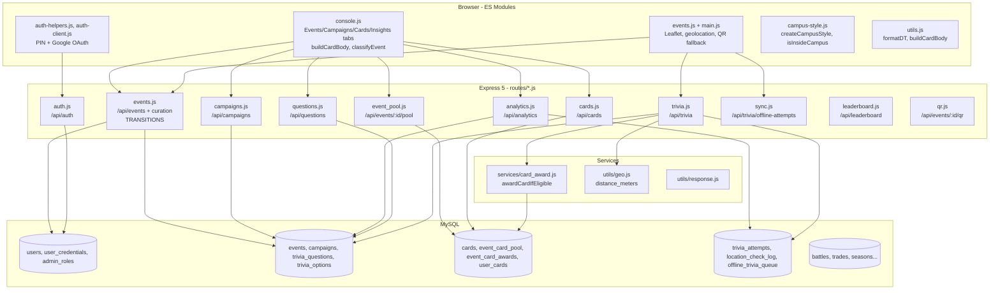

# Component Diagram

## Overview

Components follow Express router boundaries. Each router owns its tables and is tested in isolation via `pool.query` mocks.

## Component Responsibilities

| Component | File | Owns tables | Key interfaces |
|-----------|------|-------------|----------------|
| Events + Curation | `routes/events.js:42` | `events`, `campaigns` FK | `GET /` (public PUBLISHED filter `79`), `POST` (DRAFT default), `PUT` (TRANSITIONS check), `POST /:id/transition`, `POST /:id/retire` |
| Campaigns | `routes/campaigns.js:1` | `campaigns` | `POST /` term/open_day, `DELETE` unlinks `events.campaign_id`, bulk `POST /:id/events` |
| Analytics | `routes/analytics.js:1` | read `trivia_attempts`+`events` | `GET /questions/hard?threshold=0.6`, `GET /events/stale?days=30`, `GET /overview` |
| Questions | `routes/questions.js:24,45` | `trivia_questions`, `trivia_options` | `validateQuestion`, `GET /events/:id/questions`, `POST`, `PUT`, `DELETE` |
| Trivia | `routes/trivia.js:40` | `trivia_attempts`, `location_check_log` | `GET /event/:id` + `POST /submit` + `isEventPlayable` |
| Cards/Pool | `routes/cards.js:58`, `event_pool.js:28` | `cards`, pools, `user_cards` | `POST /`, `POST /sell` (duplicate check), `GET /:id/pool` |
| Auth | `routes/auth.js:7` | `users`, `user_credentials`, `admin_roles` | `POST /login` (hashPin), `POST /register`, `GET /me`, `POST /logout` |
| Services | `services/card_award.js:1`, `utils/geo.js` | — | `awardCardIfEligible` (UNIQUE backstop), `distance_meters` |

## Interfaces & Contracts

- All routers use `requireAuth` (session) + `requireEventAuthor` / `requireCardAuthor` (role) middleware; 401/403 JSON on fail (tested in `*test.js`).
- `pool.query` is the only DB boundary — mocked in every `*.test.js` via `jest.unstable_mockModule('../utils/db.js')`.
- Frontend imports are pure ESM: `campus-style.js` never fetches `campus.geojson` (retired render source), only `isInsideCampus()` pure bbox.

## Testability

Each component is unit-tested with an ephemeral `express` + `http.createServer` + `fetch` harness (see `routes/leaderboard.test.js:22`). Coverage per component shown in `testing/test-plan.md` (backend/routes 80.3%, frontend/js 91.1%).
