# Database Design

This document details the relational database design for Adamas2Aurum. The database is hosted on an Aiven MySQL instance and managed via SQL scripts (`/db/schema.sql` and `/db/seed.sql`).

---

## Class Diagram

**Golden Hammer** for our DB design.

> Subject to change based on current needs, but will be revised here as quickly as possible to stay up to date with the current live DB.

The picture exported from [draw.io](https://draw.io) can be found in the current repo directory alongside this file.

```mermaid
classDiagram
    class User {
        +int userId
        +string providerId
        +string email
        +string name
        +string avatarUrl
        +int points
        +DateTime createdAt
        +DateTime updatedAt
    }

    class UserCredential {
        +int userId
        +string pinHash
    }

    class AdminRole {
        +int roleId
        +int userId
        +AdminRoleType role
        +DateTime grantedAt
        +int grantedBy
    }

    class Event {
        +int eventId
        +string title
        +string description
        +decimal latitude
        +decimal longitude
        +int radiusMeters
        +int pointThreshold
        +int pointReward
        +DateTime startsAt
        +DateTime endsAt
        +int repeatInterval
        +int attemptCooldownS
        +int maxAttemptsPerWindow
        +boolean isActive
        +int authorId
        +DateTime createdAt
    }

    class TriviaQuestion {
        +int questionId
        +int eventId
        +QuestionFormat format
        +string body
        +int timeLimitS
        +int difficulty
    }

    class TriviaOption {
        +int optionId
        +int questionId
        +string body
        +boolean isCorrect
    }

    class Card {
        +int cardId
        +string name
        +string flavourText
        +string imageUrl
        +CardCategory category
        +CardRarity rarity
        +int statAttack
        +int statLocation
        +int statInfluence
        +int statLegacy
        +int statEra
        +string abilityName
        +string abilityDesc
        +DateTime createdAt
    }

    class EventCardPool {
        +int poolId
        +int eventId
        +int cardId
        +int weight
        +int globalCopyLimit
        +int copiesAwarded
    }

    class UserCard {
        +int userCardId
        +int userId
        +int cardId
        +int quantity
        +DateTime obtainedAt
    }

    class EventCardAward {
        +int awardId
        +int userId
        +int eventId
        +int cardId
        +DateTime awardedAt
    }

    class LocationCheckLog {
        +int checkId
        +int userId
        +int eventId
        +decimal claimedLat
        +decimal claimedLng
        +decimal distanceMeters
        +LocationStatus status
        +int prevCheckId
        +decimal travelSpeedMs
        +DateTime checkedAt
    }

    class TriviaAttempt {
        +int attemptId
        +int userId
        +int eventId
        +int questionId
        +int locationCheckId
        +boolean isCorrect
        +int answerTimeMs
        +int cardAwardedId
        +int pointsAwarded
        +boolean hintUsed
        +int attemptNumber
        +DateTime cooldownUntil
        +DateTime attemptedAt
    }

    class UserDiscoveredEvent {
        +int userId
        +int eventId
        +DateTime firstSeen
    }

    class AuditLog {
        +int logId
        +int actorId
        +AuditAction action
        +string targetTable
        +int targetId
        +json beforeState
        +json afterState
        +DateTime changedAt
    }

    class Battle {
        +int battleId
        +int player1Id
        +int player2Id
        +int winnerId
        +BattleStatus status
        +DateTime startedAt
        +DateTime endedAt
        +DateTime createdAt
    }

    class BattleDeck {
        +int deckId
        +int battleId
        +int userId
        +int cardId
        +int slotPosition
        +int finalHealth
    }

    class BattleTurn {
        +int turnId
        +int battleId
        +float turnNumber
        +int actingUserId
        +int deckSlotPlayedId
        +int deckSlotTargetedId
        +TurnAction action
        +int damageDealt
        +boolean landed
        +json effectData
        +DateTime createdAt
    }

    class Trade {
        +int tradeId
        +int initiatorId
        +int receiverId
        +int initiatorCardId
        +int receiverCardId
        +TradeStatus status
        +DateTime createdAt
        +DateTime resolvedAt
    }

    class PointTransaction {
        +int txnId
        +int userId
        +int delta
        +PointReason reason
        +int referenceId
        +DateTime createdAt
    }

    class Cosmetic {
        +int cosmeticId
        +string name
        +string description
        +CosmeticType type
        +int pointCost
        +string imageUrl
    }

    class UserCosmetic {
        +int userId
        +int cosmeticId
        +DateTime obtainedAt
    } 

    class Season {
        +int seasonId
        +string name
        +DateTime startsAt
        +DateTime endsAt
        +boolean isActive
    }

    class LeaderboardEntry {
        +int entryId
        +int seasonId
        +int userId
        +int wins
        +int losses
        +int score
    }

    User "1" -- "0..1" UserCredential
    User "1" -- "0..*" AdminRole : has
    User "1" -- "0..*" Event : authors
    User "1" -- "0..*" UserCard : owns
    User "1" -- "0..*" EventCardAward : awarded
    User "1" -- "0..*" LocationCheckLog : submits
    User "1" -- "0..*" TriviaAttempt : attempts
    User "1" -- "0..*" UserDiscoveredEvent : discovers
    User "1" -- "0..*" AuditLog : acts
    User "1" -- "0..*" Battle : participates
    User "1" -- "0..*" Trade : initiates/receives
    User "1" -- "0..*" PointTransaction : transacts
    User "1" -- "0..*" UserCosmetic : owns
    User "1" -- "0..*" LeaderboardEntry : ranks

    Event "1" -- "0..*" TriviaQuestion : contains
    Event "1" -- "0..*" EventCardPool : pools
    Event "1" -- "0..*" EventCardAward : sources
    Event "1" -- "0..*" LocationCheckLog : geofences
    Event "1" -- "0..*" TriviaAttempt : hosts
    Event "1" -- "0..*" UserDiscoveredEvent : target

    TriviaQuestion "1" -- "0..*" TriviaOption : options
    TriviaQuestion "1" -- "0..*" TriviaAttempt : targeted

    Card "1" -- "0..*" EventCardPool : mapped
    Card "1" -- "0..*" UserCard : held
    Card "1" -- "0..*" EventCardAward : awarded
    Card "1" -- "0..*" TriviaAttempt : awarded
    Card "1" -- "0..*" BattleDeck : slotted
    Card "1" -- "0..*" Trade : offered/received

    LocationCheckLog "1" -- "0..*" TriviaAttempt : validates
    LocationCheckLog "0..1" -- "0..*" LocationCheckLog : prevCheck

    Battle "1" -- "0..*" BattleDeck : decks
    Battle "1" -- "0..*" BattleTurn : turns
    BattleDeck "1" -- "0..*" BattleTurn : playedSlot
    BattleDeck "1" -- "0..*" BattleTurn : targetedSlot

    Season "1" -- "0..*" LeaderboardEntry : tracks
    Cosmetic "1" -- "0..*" UserCosmetic : owned
```

