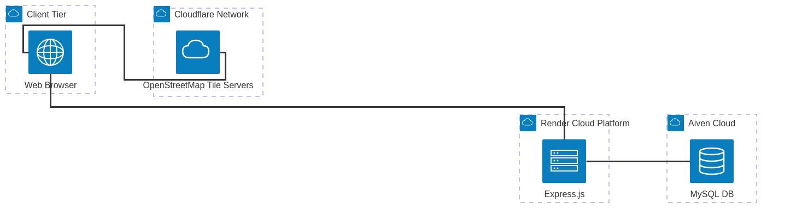

# Deployment Diagram

This document details the deployment diagram for Adamas2Aurum.

**Cloud Infrastructure**: Render (Backend API), Cloudflare (Frontend Hosting), Aiven (MySQL Hosting)

> Note: Leaflet JS is used for our interactive map.

