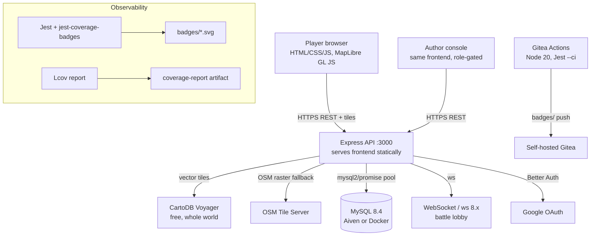
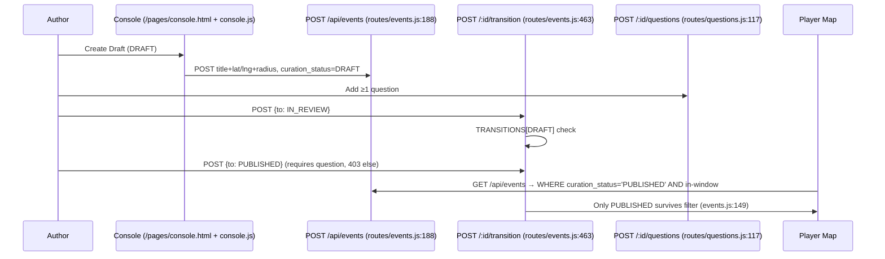

# System Architecture

## 1. Architectural Pattern — Layered Client-Server

Adamas2Aurum is a **layered, RESTful client-server** system with session affinity. The choice is deliberate against MVC frameworks (React) and BaaS alternatives.

| Decision | Alternative considered | Rationale (from `technology-stack.md`) |
|----------|------------------------|----------------------------------------|
| Vanilla ES Modules + Leaflet | React | Team familiarity, no build-step for HTML/CSS/JS, React learning curve in one semester |
| Express 5 stateless REST | Fastify / Koa | Same language as frontend, richest middleware/docs, `express-session` + `express-mysql-session` bridge for Better Auth |
| MySQL via `mysql2/promise` | Postgres/ORM | 2nd-year DBF familiarity, Aiven managed, `CREATE TABLE IF NOT EXISTS` safe startup |
| Session + Better Auth bridge | JWT only | Supports PIN (local) + Google OAuth without rewriting every route (`server.js:109` bridge maps both to `req.session.user`) |
| MapLibre/Carto vector tiles | Google Photorealistic 3D, Cesium | Cartoon “PoGO” style, no API key/billing, `campus-style.js:65` single style truth |

Pattern yields **three layers**: Presentation (Browser), Application (Express routers + services), Data (MySQL + session store). Cross-cutting: `utils/geo.js`, `services/card_award.js`, `routes/analytics.js`.

## 2. System Context

- Frontend and API share origin (`server.js:209` static serving) → no CORS for same-origin calls; dev `Vite` optional.
- Tiles never carry gameplay data — only markers from `GET /api/events` (live OSM, filtered `isInsideCampus()`).
- **Map details:** See [`implementation/map-system.md`](../../implementation/map-system.md) for renderer (MapLibre 3.6.2), Carto Voyager restyle, pages (`index.html`/`events.html`/`map.html`), data flow (no static `campus.geojson`), geofence bbox, day/night, and GPS fixes.

## 3. Data Flow — Curation (new Sprint 3)

Retire path: `POST /:id/retire` → `RETIRED ∧ is_active=FALSE`; insights `GET /api/analytics/events/stale?days=30` lists 30-day-ended PUBLISHED for batch retire.

## 4. Data Flow — Trivia Verification

`GET /api/trivia/event/:id` (trivia.js:87) fetches event once, `isEventPlayable()` checks `curation_status` + `is_active` + window before location. `POST /submit` re-checks playable, verifies `distance_meters` vs `radius_meters`, grades `is_correct` server-side only, times via `req.session.trivia_issue.issued_at` (anti-fake `answer_time_ms`), awards card via `services/card_award.js` (`awardCardIfEligible`).

## 5. Deployment Mapping

- **Render** (backend), **Cloudflare Pages** (frontend static), **Aiven** (MySQL) — see `deployment/deployment.md`.
- Gitea Actions runners: `test.yml` (unit), `ci.yml` (coverage + badges + artifact, Node 20), `format-check.yml` (Prettier). See `deployment/ci.md`.

## 6. Non-Functional Fulfilment

- **Security:** No `is_correct` leak, session bridge, role middleware, `ER_DUP_ENTRY` backstop for card race.
- **Performance:** Pool 10, `coverageThreshold 70%` failing pipeline, `lcp` &lt;1.5s via CDN tiles.
- **Maintainability:** `execute_sql_script` idempotent schema, `ensure_curation_schema()` migration, `collectCoverageFrom` per-project.

## 7. Alternatives Rejected

React + Next, Prisma ORM, JWT-only, GitHub-hosted badges — rejected per constraints (self-hosted, no external Codecov/SonarQube, team familiarity).
