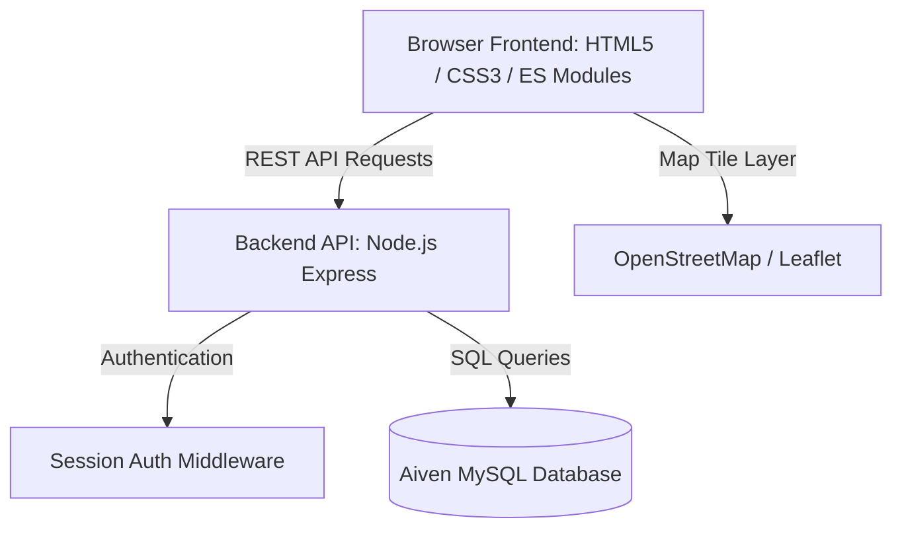

# System Architecture

This document outlines the architectural patterns for Adamas2Aurum.

---

## Stack Overview

* **Frontend:** HTML5, CSS, ES Modules, Leaflet JS (Interactive Mapping)
* **Backend:** Node.js, Express.js
* **Database:** MySQL Database
* **Testing:** Jest Framework
* **Project Management:** Taiga (Kanban Board)
* **Cloud Infrastructure:** Render (Backend API), Cloudflare (Frontend Hosting), Aiven (MySQL Hosting)

---

## Architectural Data Flow

