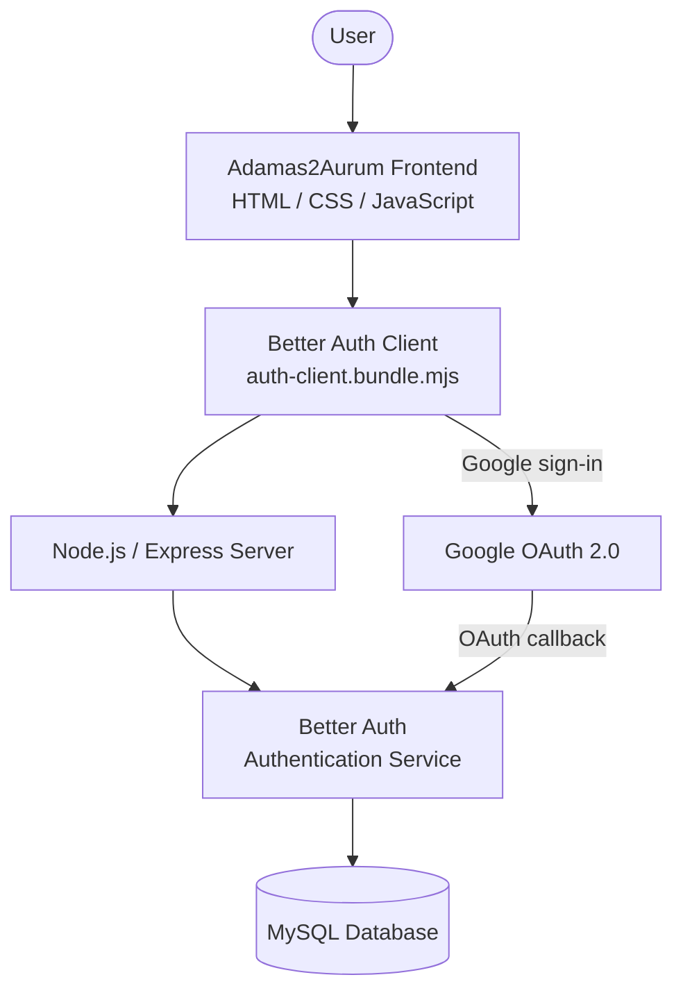
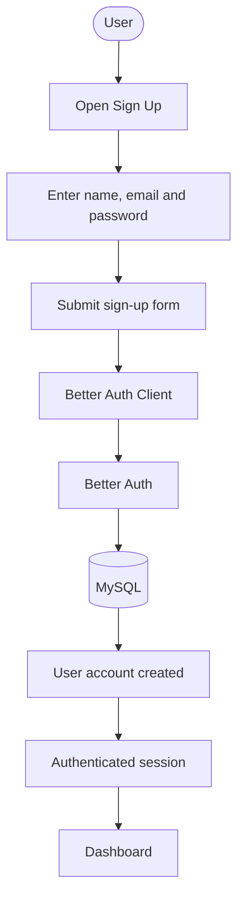
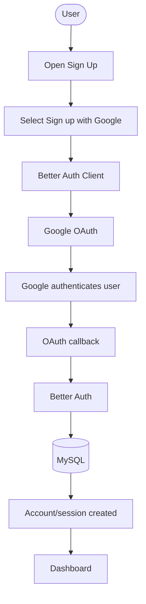
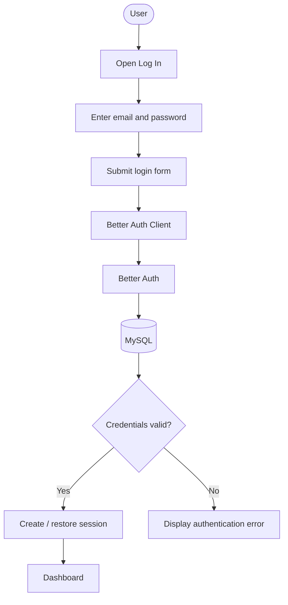
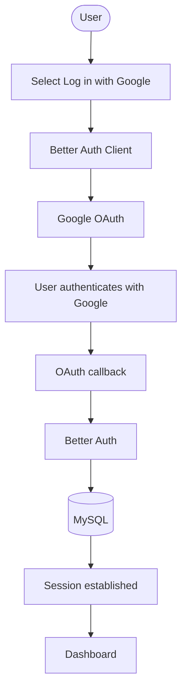
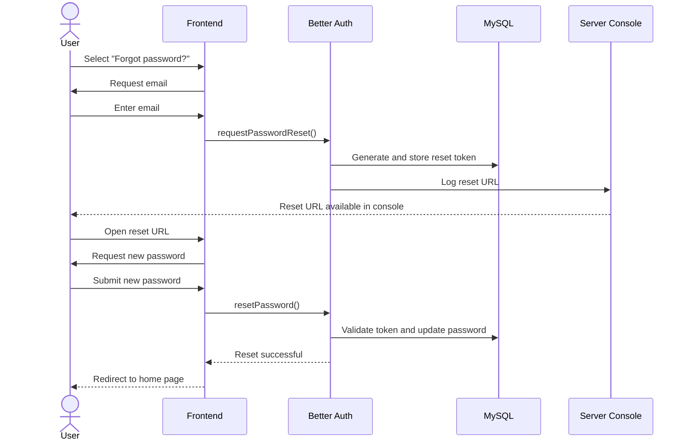
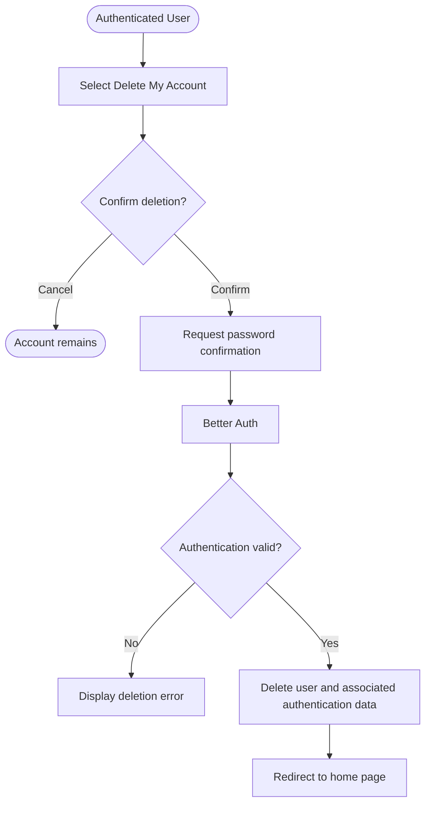
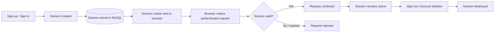
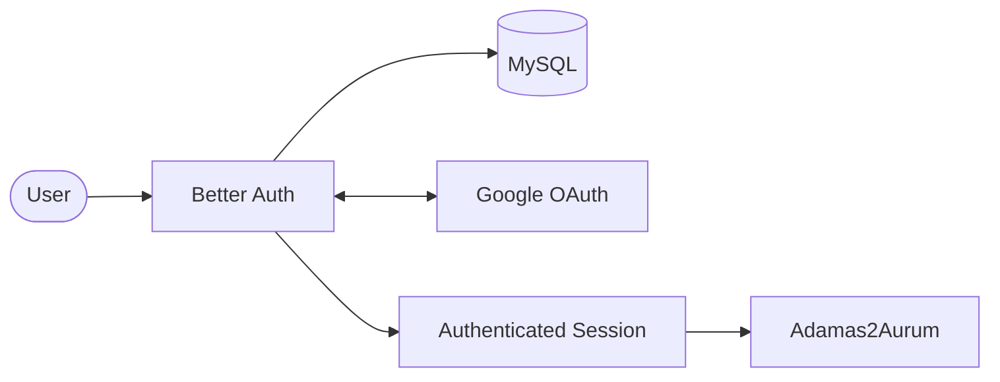

# Authentication

## 1. Overview

Adamas2Aurum uses **Better Auth** as the central authentication system. It provides email/password authentication, Google OAuth, session management, password reset, and account deletion.

The authentication system is integrated with the project's existing **Node.js + Express server** and **MySQL database**.

### Authentication at a Glance

| Feature | Implementation |
|---|---|
| Email/password sign-up | Better Auth |
| Email/password sign-in | Better Auth |
| Google sign-in | Google OAuth 2.0 through Better Auth |
| Password reset | Better Auth |
| Account deletion | Better Auth |
| Session management | Better Auth |
| Password hashing | Better Auth |
| Authentication database | MySQL |
| Frontend | Plain HTML + CSS + JavaScript |

---

## 2. Authentication Architecture

The authentication system consists of the browser client, Express server, Better Auth, MySQL, and Google OAuth.



### Component Responsibilities

| Component | Responsibility |
|---|---|
| **Frontend** | Provides sign-up, login, password reset and account-management interfaces |
| **Better Auth Client** | Sends authentication requests from the browser |
| **Express** | Acts as the application's HTTP server and forwards authentication requests |
| **Better Auth** | Handles authentication logic, credentials, sessions, OAuth and account operations |
| **MySQL** | Stores users, sessions, linked accounts and verification tokens |
| **Google OAuth** | Provides external identity authentication |

The Express server delegates authentication requests under `/api/auth/*` to Better Auth.

---

## 3. Authentication Requirements

| Requirement | Implementation | Status |
|---|---|---|
| User sign-up | Better Auth email/password and Google OAuth | Implemented |
| User sign-in | Better Auth email/password and Google OAuth | Implemented |
| Password reset | Better Auth reset-token flow | Implemented |
| Account deletion | Better Auth account deletion | Implemented |
| Session management | Better Auth sessions and cookies | Implemented |
| Password hashing | Handled internally by Better Auth | Implemented |
| Custom authentication system | Not used | Requirement satisfied |

---

## 4. Authentication Methods

Users can authenticate using either their email/password credentials or Google.

| Authentication Method | User Action | Authentication Provider |
|---|---|---|
| **Email/password sign-up** | Enter name, email and password | Better Auth |
| **Email/password sign-in** | Enter email and password | Better Auth |
| **Google** | Select Google sign-in/sign-up | Google OAuth 2.0 through Better Auth |

The frontend authentication handlers call Better Auth through the exposed `authClient`.

---

## 5. Sign-Up

Users can create an account using either email/password authentication or Google.

### 5.1 Email/Password Sign-Up



The email sign-up handler sends the user's name, email and password to Better Auth using:

```js
authClient.signUp.email()
```

### 5.2 Google Sign-Up



Google sign-up uses Better Auth's social sign-in functionality with the Google provider.

---

## 6. Sign-In

### 6.1 Email/Password Sign-In



The login form uses:

```js
authClient.signIn.email()
```

to submit email/password credentials to Better Auth.

### 6.2 Google Sign-In



---

## 7. Password Reset

Password reset is implemented using Better Auth's reset-token flow.

The current development implementation **does not send an email**. Instead, the generated reset URL is logged to the server console.

### 7.1 Password Reset Flow



### 7.2 Password Reset Behaviour

| Aspect | Implementation |
|---|---|
| **Reset request** | User provides their email |
| **Token generation** | Better Auth |
| **Token storage** | MySQL verification table |
| **Email delivery** | Not configured in the development implementation |
| **Reset URL** | Logged to the server console |
| **Token validation** | Better Auth |
| **New password** | Submitted through reset-password page |
| **Password update** | Handled by Better Auth |
| **Successful reset** | User is redirected to `/` |

---

## 8. Account Deletion

Users can delete their account from the authenticated application.



### 8.1 Behaviour by Authentication Method

| Authentication Method | Password Required? | Behaviour |
|---|---|---|
| **Email/password** | Yes | User confirms their password before deletion |
| **Google OAuth** | No | Password field may be left empty |

---

## 9. Session Management

Better Auth manages the application's authentication sessions.

### 9.1 Session Lifecycle



---

## 10. Database Integration

Better Auth manages the authentication database schema.

The project's migration script determines which Better Auth tables and columns are required and applies the migrations to MySQL.

### 10.1 Authentication Tables

| Table | Purpose |
|---|---|
| `user` | Stores user profile information |
| `session` | Stores active authentication sessions |
| `account` | Stores linked authentication providers |
| `verification` | Stores verification and password-reset tokens |

The authentication database therefore separates user information, sessions, linked accounts and verification data.

---

## 11. Security Decisions

The project delegates security-sensitive authentication functionality to Better Auth instead of implementing it manually.

| Security Decision | Reason |
|---|---|
| **Better Auth used for authentication** | Avoids implementing a custom authentication system |
| **Password hashing handled by Better Auth** | Prevents custom credential hashing logic |
| **OAuth handled by Better Auth** | Delegates OAuth processing and related security handling |
| **Session cookies managed by Better Auth** | Reduces the risk of incorrect session-cookie configuration |
| **Secrets stored in `.env`** | Prevents credentials and OAuth secrets from being committed to source control |
| **Google provider conditionally enabled** | Prevents OAuth configuration from being used when required credentials are unavailable |
| **Password reset URL logged during development** | Allows the reset flow to be tested without configuring SMTP |

---

## 12. Technologies Used

| Technology | Purpose |
|---|---|
| **Better Auth** | Core authentication library |
| **Node.js** | Server runtime |
| **Express** | HTTP server and Better Auth request handling |
| **MySQL** | Authentication database |
| **mysql2** | MySQL connection driver |
| **dotenv** | Loads environment variables |
| **Google OAuth 2.0** | External authentication provider |
| **JavaScript** | Frontend and server-side application logic |
| **HTML** | Authentication interface |
| **CSS** | Authentication interface styling |
| **esbuild** | Bundles the Better Auth browser client |

---

## 13. Implementation

### 13.1 Express Authentication Handler

The Express server delegates authentication requests to Better Auth:

```js
app.all("/api/auth/*", toNodeHandler(auth));
```

This allows Better Auth to handle the authentication endpoints rather than requiring separate custom routes for each authentication operation.

### 13.2 Better Auth Server Configuration

The server-side Better Auth configuration contains the following major components:

| Configuration | Purpose |
|---|---|
| **MySQL connection pool** | Provides database access |
| **Google OAuth provider** | Enables Google authentication |
| **Email/password** | Enables credential-based authentication |
| **Account deletion** | Enables user account deletion |
| **Password reset callback** | Handles reset URL generation during development |

The Google provider is conditionally registered when the required Google OAuth environment variables are available.

### 13.3 Browser Client

The Better Auth browser client is bundled before being loaded by the frontend.

```text
src/client-entry.js
        │
        ▼
     esbuild
        │
        ▼
public/js/auth-client.bundle.mjs
        │
        ▼
Browser authentication pages
```

The client entry point creates the Better Auth client using the application's current origin and exposes it to the frontend authentication handlers.

### 13.4 Frontend Authentication Handlers

| Function | User Action | Better Auth Operation |
|---|---|---|
| `handleGoogleSignUp()` | Sign up with Google | `signIn.social()` |
| `handleGoogleLogin()` | Log in with Google | `signIn.social()` |
| `handleEmailSignUp()` | Submit sign-up form | `signUp.email()` |
| `handleEmailLogin()` | Submit login form | `signIn.email()` |
| `handleForgotPassword()` | Select forgot password | `requestPasswordReset()` |

---

## 14. Testing and Verification


## 15. Authentication Summary

The Adamas2Aurum authentication system uses **Better Auth as the central authentication layer**, integrated with the Node.js/Express server and MySQL database.

The system supports:

- Email/password registration
- Email/password login
- Google OAuth
- Password reset
- Account deletion
- Session management

The implementation deliberately delegates security-sensitive authentication operations to Better Auth rather than implementing custom credential handling.

### Authentication Architecture Summary



This architecture keeps authentication functionality centralised while allowing the rest of the application to work with authenticated user sessions.
