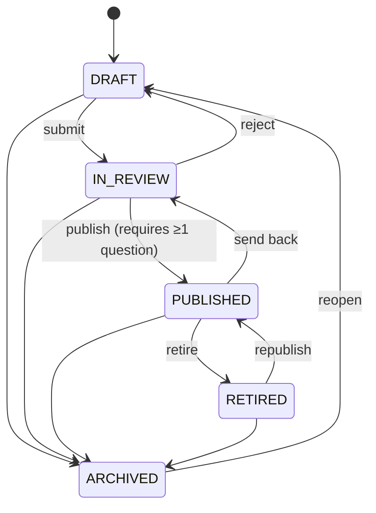

# Curation Workflow — Authoring as Curation

> **Sprint 3** — stakeholder feedback: “Authoring should become curation. Content should be drafted, reviewed, and published rather than going live as written, campaigns scheduled around a term or an open day, old events retired, and questions everybody gets wrong surfaced so they can be repaired.”

This replaces the old “goes live as written” model (`is_active` only). See `docs/curation.md` in app and `.gitea/workflows/ci.yml`.

## 1. State Machine



Constants in `routes/events.js:6` (`VALID_CURATION`, `TRANSITIONS`). Only `PUBLISHED ∧ is_active ∧ in-window` is public (`routes/events.js:149`).

## 2. Database

- `events.curation_status ENUM('DRAFT','IN_REVIEW','PUBLISHED','RETIRED','ARCHIVED') DEFAULT 'DRAFT'` + `campaign_id FK campaigns(campaign_id)` added via `server.js:249 ensure_curation_schema()` (idempotent `ALTER ...` swallowed on `ER_DUP_FIELDNAME`, backfill `PUBLISHED` where `is_active=TRUE`).
- `campaigns` table `db/schema.sql:461`: `name`, `description`, `term` (e.g. `2026 T1`), `is_open_day BOOLEAN` + `open_day_label`, `starts_at/ends_at UTC`, `status DRAFT/SCHEDULED/ACTIVE/ARCHIVED`, `created_by FK users`.
- No schema for analytics — pure reads over `trivia_attempts`.

## 3. Backend API

### Events (`routes/events.js:188,463,518`)

| Endpoint | Guard | Logic |
|----------|-------|-------|
| `POST /api/events` | `requireAuth`+`requireEventAuthor` | Accepts `curation_status` (validated) + `campaign_id`, defaults `DRAFT`; builds SQL with/without columns for migration safety |
| `PUT /api/events/:id` | same | Validates `TRANSITIONS[from]` else `400 Invalid transition` |
| `POST /:id/transition {to}` | same | Checks `hasCurationColumn`, `PUBLISHED` requires `COUNT(trivia_questions)>0` else 400, `Already X` 200 |
| `POST /:id/retire` | same | Sets `RETIRED, is_active=FALSE` |
| `GET /` public | — | `WHERE curation_status='PUBLISHED' AND is_active TRUE AND in-window` if column exists else fallback (79→164) |

### Campaigns (`routes/campaigns.js:1`)

```
GET /api/campaigns                 public SCHEDULED|ACTIVE in-window
GET /api/campaigns?all=true        author all
POST /api/campaigns {name*, term, is_open_day, open_day_label, starts_at, ends_at, status}
PUT /:id, DELETE /:id (unlinks events), POST /:id/events {event_ids}, DELETE /:id/events/:eventId
```

`toUtcDatetime()` normalises to UTC `YYYY-MM-DD HH:MM:SS`.

### Analytics (`routes/analytics.js:1`) — author only

```
GET /api/analytics/questions/hard?threshold=0.6&min_attempts=5&limit=20
  GROUP BY trivia_questions HAVING failure_rate >= threshold → [{id, text, attempts, wrong, failure_rate, options:[{is_correct}]}]
GET /api/analytics/events/stale?days=30
  WHERE ends_at < NOW()-days AND curation_status!='RETIRED'
GET /api/analytics/overview → {statusCounts, campaignCounts, hard_questions, stale_events}
```

## 4. Trivia Gating

`routes/trivia.js:48 isEventPlayable()` blocks `GET /trivia/event/:id` (87) and `POST /submit` (376) if not `PUBLISHED/active/in-window` → `403`.

## 5. Frontend Console (`js/console.js:60`, `pages/console.html:223`)

- Top tabs `Events|Campaigns|Cards|Insights` (lazy-load).
- Events: filter chips injected for `draft/in_review/published/retired/archived` (`1450`), `classifyEvent()` prioritises `curation_status` (`239`), cards show curation pill (`utils.js:66`) + workflow buttons `Submit for review/Publish/Retire` → `POST .../transition`.
- Form: selects `f-curation`/`f-campaign` (`660`), `populateCampaignSelect()` (`420`), `renderCurationActions()` pill actions, payload includes both fields (`495`).
- Campaigns tab: list (status/term/open-day pills) + form (window, term, linked-events checkboxes diffed via `POST/DELETE /:id/events`).
- Insights tab: overview cards (`GET /overview`), hard list (red `failure_rate%`, options with ✓, Repair jumps to Questions sub-tab), stale list (Retire/Edit).

## 6. Verification

- **Tests 19/207** covering workflow: `routes/events.test.js:1` (8 transitions, retire, invalid), `campaigns.test.js:1`, `analytics.test.js:1`.
- **Manual:** Draft → add question → `IN_REVIEW` → `PUBLISHED` appears on player map; `RETIRED` vanishes; hard question flagged at 60/5.
- **Coverage:** `All 83.4%`, `backend/routes 80.3%`, `frontend/js 91.1%` (see `testing/test-plan.md`).

## 7. Migration

Fresh DB: `campaigns` in `schema.sql`; columns via `ensure_curation_schema()`. Existing DB: `ALTER` swallowed, FK idempotent, backfill keeps live events live; `isEventPlayable` tolerates missing `curation_status` (tests mock) and `is_active===false` only.
