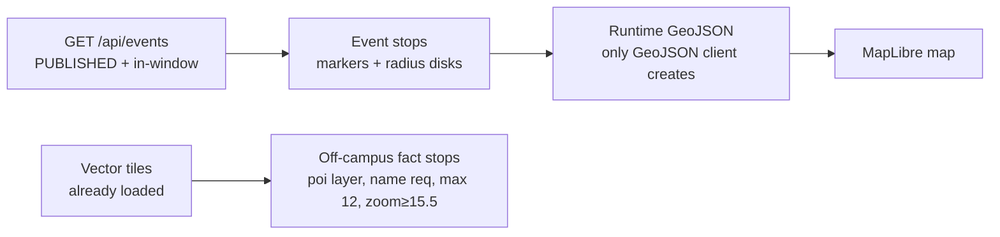

# Map System — Wits Quest Live World Map

> **Source of truth for the playable map.** This doc is the Docusaurus-published version of [`Adamas2Aurum/MAP.md`](https://sdp.ms.wits.ac.za/404-found-us/Adamas2Aurum/src/branch/dev/MAP.md) (app repo), kept in sync. For code, see `app/src/frontend/js/campus-style.js` and `app/src/frontend/js/events.js` / `main.js`.

Pokémon GO-style live world map for **Wits Quest** (University of the Witwatersrand, Braamfontein). Players roam a gamified world map; tappable event stops live at Wits; challenge attempts are gated to players physically on campus. Falls under **Design → Architecture** (renderer & geofence) and **Implementation → Frontend** (pages & gameplay).

## Architecture

| Concern | Choice | Why | File |
|---------|--------|-----|------|
| **Renderer** | **MapLibre GL JS v3.6.2** (CDN) | 3D extrusion for PoGO look, no API key/billing; Leaflet cannot extrude buildings | `campus-style.js:1` |
| **Basemap** | **CartoDB Voyager vector tiles** (whole world, live OSM) | Free, vector, restyled in code to PoGO palette — green base `#7CC5A2`, parks `#66B78E`, water `#8ACDE8`, muted extruded buildings, asphalt roads + solid yellow edge lines, zero street/POI labels | `campus-style.js:65` `createCampusStyle()` |
| **Style truth** | Single source `campus-style.js` | `createCampusStyle()`, `CAMPUS_CAMERA`, `CAMPUS_BOUNDS`, `isInsideCampus()`, day/night engine — all map pages import from it; guarantees `index.html` and `events.html` stay identical | `frontend.md` §2 |
| **Legacy** | `Leaflet` was evaluated (see `technology-stack.md`) but rejected: Google Maps limits, no extrusion; `campus.geojson` retired as render source (kept in `public/` + `backend/` for reference only) | — | `MAP.md` § Data flow |

## Pages

| Page | File | Role | Tested |
|------|------|------|--------|
| **Main game map** | `app/src/frontend/index.html` + `js/main.js` | GPS avatar, stops, geofence, trivia modals, HUD | Manual + `geolocation.test.js` |
| **2D preview** | `app/src/frontend/pages/map.html` | World overview + event pins, no GPS | Manual |
| **Events (player dashboard)** | `app/src/frontend/pages/events.html` + `js/events.js` | Sidebar list, range pills, `challenge/QR` flow, live proximity | `campus-style.test.js` + manual |

All three share `campus-style.js` camera constants (`CAMPUS_CAMERA: center [28.0305,-26.1895] zoom 18.5 pitch 72`, `CAMPUS_MIN/MAX_ZOOM 17–20`, `CAMPUS_MIN/MAX_PITCH 55–70`).

## Data Flow — No Static Campus File

- **`campus.geojson` retired** — neither copy (`app/src/frontend/public/`, `app/src/backend/`) is fetched/drawn. Kept for reference/future `booleanPointInPolygon` swap.
- **Event stops:** coordinates + metadata from backend `GET /api/events` (public filter `curation_status='PUBLISHED'` + `is_active` + window), with 6-stop hardcoded fallback when offline.
- **Off-campus fact stops:** queried live from already-loaded vector tiles (`poi` layer).
- **Proximity radii:** `circleCoords()` builds 48-step `Polygon` per event at runtime — the *only* GeoJSON the client creates.

## Gameplay Systems

### Player Avatar
Continuous `navigator.geolocation.watchPosition` (high accuracy, `maximumAge 5000`), blue dot + accuracy circle + compass/GPS heading wedge, idle/walk CSS, fading breadcrumb trail. **Follow mode** centers on move; drag → free-look; 🎯 recenter restores.

### Geofence — Bbox (known limitation)
Rectangular `CAMPUS_BOUNDS` `west 28.017, east 28.050, south -26.198, north -26.173` in `campus-style.js:14`. `isInsideCampus(lng,lat)` bbox check decides on/off-campus. Off-campus: browse + info banner; tap → *“You need to be on Wits campus”* instead of trivia. *Limitation:* bbox not true polygon — across M1 still counts inside; future `Turf.booleanPointInPolygon` with accurate boundary.

### Day/Night
Real-time `nightFactorAt(date)` (Dawn 04:30–07:00, Dusk 17:00–19:30, smoothstep) → blended palette (day `#7CC5A2` → night `#0E2233` navy), `applyMapTheme()` per `setPaintProperty`, re-applied every 60s via `startDayNightCycle()`. Covered by `daynight.test.js` + `campus-style.test.js:60`.

### Camera
Street-level lock `zoom 17–20`, `pitch 55–70°`, PoGO follow, `dragstart` → `followMode=false`, `btn-recenter` → `flyTo` `CAMPUS_CAMERA`, idle pull-back to campus.

### Recent Fixes (Sprint 2–3, from `MAP.md:57`)

**1. Live GPS Player Tracker & Proximity Overhaul (`events.js`):**
- *Dynamic proximity* `refreshAllStopsProximity()` on every GPS tick (vs once on load) + *dynamic popup* `openStopPopup()` → “⚡ Attempt Challenge” renders immediately in range.
- *Auto-centering* on first fix, *follow* `easeTo` until drag.
- *No 10s freezes:* `loadEvents()` prefers cached watch coordinates; `_challenge()` uses live fix if `accuracy ≤50m`.

**2. Unified Dual-Session Logout (`auth-helpers.js`):**
- `logout()` `Promise.allSettled` on `POST /api/auth/logout` + `POST /api/auth/sign-out`, `try...finally` cleanup, fixes leaderboard missing listener and OAuth re-login loop.

## Verification

- `npm run test:coverage` (14 Sep 2026): **19 suites, 207 tests** — `frontend/js 91.1%` (`campus-style 94.9%`, `utils 95.2%`, `auth-helpers 88.8%`), `backend 80.3%`. Previous `MAP.md:76` `7/59` was Sprint 1 snapshot.
- `npm run format:check` — Prettier `test:coverage` 100%.
- Manual: `http://localhost:3000` vs `pages/events.html`, on/off-campus, drag/recenter, night at 20:00 (`body.night`).

## Rubric Mapping

- **Design → Architecture:** renderer choice, single style truth, bbox vs polygon trade-off.
- **Implementation → Frontend:** pages, data flow, gameplay systems (also `frontend.md:2`).
- **Implementation → Game Systems:** challenge gating, card award speed bracket.
- **Testing → Coverage:** `campus-style.test.js`, `geolocation.test.js`, `daynight.test.js`.

## AI Declaration

GPS overhaul + dual-session logout + badge were AI-assisted (Antigravity/Muse Spark) and human-verified vs `npm test` + manual map walk (see `ai-declaration.md` and `MAP.md:79`).

---

*See also: `implementation/frontend.md:2` (player map summary), `design/architecture/system-architecture.md:2` (context diagram), `implementation/curation.md` (PUBLISHED filter).*
