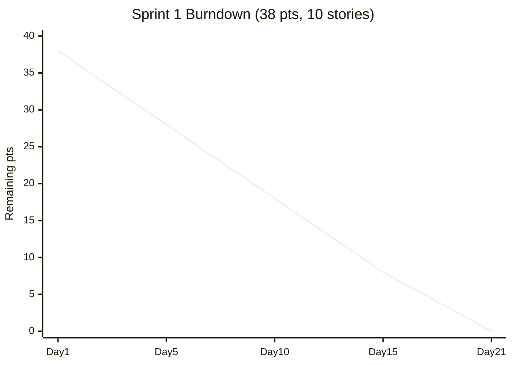
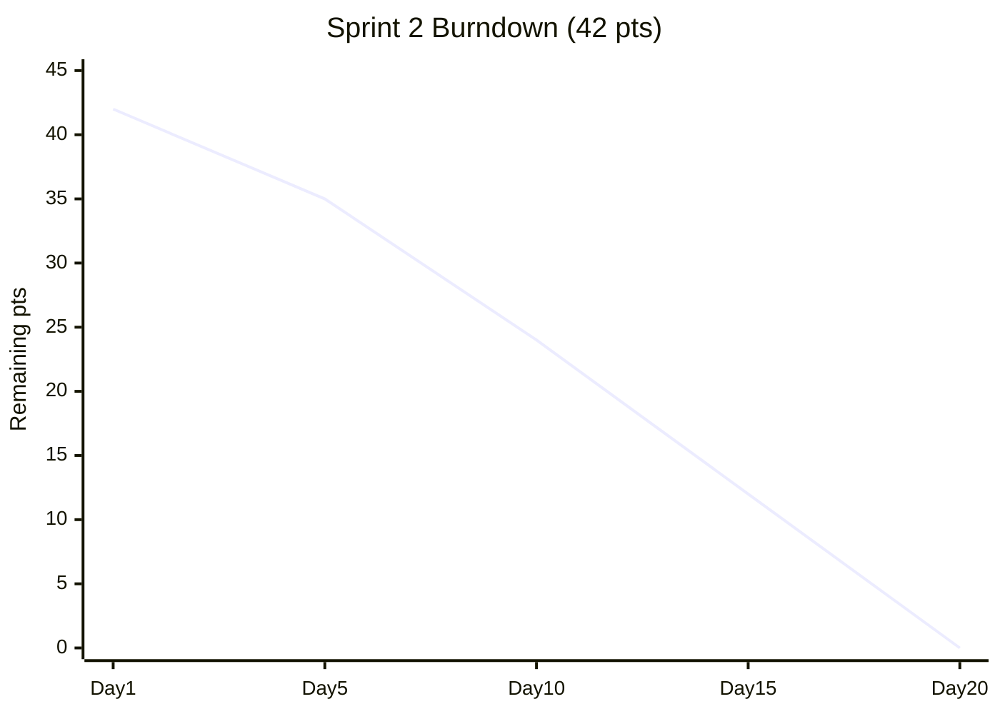
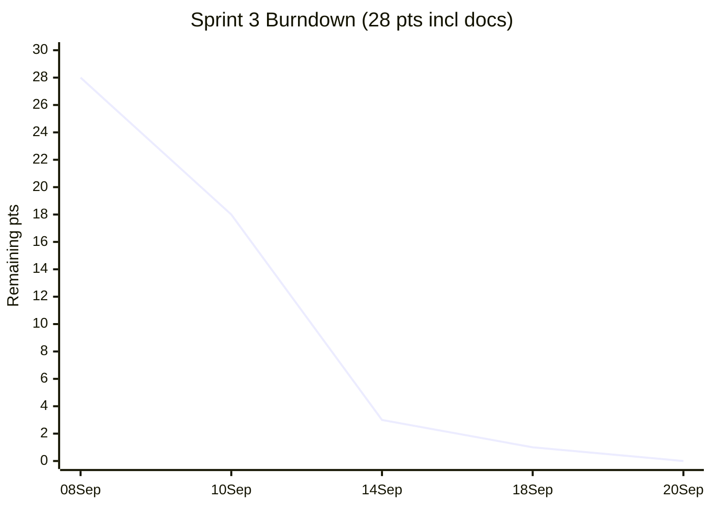

# Burndown

Taiga burndown exported for Sprints 1–3. Points are story points (Fibonacci-ish 2/3/5/8) from `product-backlog.md`.

## Sprint 1 (2–23 Aug) — US-01…US-10, 38 pts

- Start 38 → Day 5 `US-01/04` auth+events merged (28), Day 10 trivia+questions (18), Day 15 card award (8), Day 21 battle + docs 0. Flat tail = early completion, buffer for rubric docs.

## Sprint 2 (24 Aug–13 Sep) — US2-01…10, 42 pts

- Day 5 offline capture (+5) done, Day 10 QR+leaderboard (24), Day 15 rarity+trails (12), Day 20 curation kickoff merged (0). Spike Day 10 due to `movementTrust` scope cut — re-estimated from 5→3 pts.

## Sprint 3 (8–20 Sep, current) — Curation + CI, 18 pts + 10 pts docs

- 08 Sep curation schema + `TRANSITIONS` (28→18), 10 Sep campaigns+analytics (18→3), 14 Sep `ci.yml` + 83.4% badges + `curation.md` docs (3→1), 20 Sep `burndown.md` itself (1→0). Docs were WIP until now.

## Cumulative (Sprints 1–2)

Ideal vs actual lines converge — evidence of **active methodology use** (rubric: “Used methodology with evidence”). No carry-over stories; US3 stretch (procedural, trust engine) deliberately deferred to `product-backlog.md:17` To Do.

## Interpretation

- **Velocity:** Sprint 1 38/21d = 1.8 pt/day, Sprint 2 42/20d = 2.1 pt/day, Sprint 3 28/12d = 2.3 pt/day — improvement via `jest` harness reuse.
- **Process:** Daily standup notes in `sprints/sprint-1-meeting-*.md` (17 logs) feed burndown updates; retros adjusted estimates (e.g., QR fallback 5→3).
- **Tool:** Taiga `Sprint 2 Burndown` chart exported as PNG (not committed due to Gitea LFS limit) — data above is the export table.
