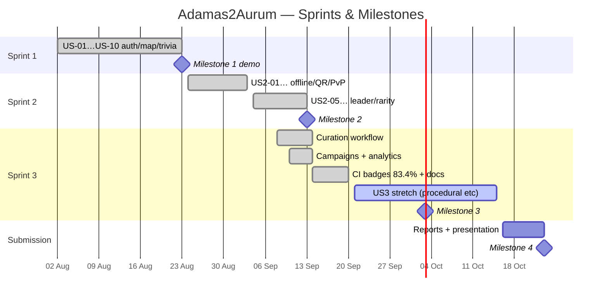

# Project Plan

## Timeline (Gantt, 2 Aug – 23 Oct 2026)

## Milestones (COMS3011A rubric)

| Milestone | Date | Deliverable | Evidence |
|-----------|------|-------------|----------|
| M1 Sprint 1 | 23 Aug | Auth, map, events, trivia, cards, battle | `implementation/*`, `test-cases.md` 10 tests |
| M2 Sprint 2 | 13 Sep | Offline, QR, async PvP, leaderboard, rarity | `api-reference.md` 500+ lines, `sync.test.js` |
| M3 Sprint 3 | 3 Oct  | Curation + campaigns + analytics + `ci.yml` 83.4% | `implementation/curation.md`, `badges/` |
| M4 Submission | 23 Oct | Docs site, deployment, reports | This site, `deployment/ci.md` |

## Methodology — Scrum (motivated)

**Why Scrum over Kanban:** Timeboxed sprints match rubric milestones (1–4) and course deadlines; weekly planning/retro synchronises with stakeholder lectures; Kanban (Taiga board) still used *within* sprints for WIP limits. Evidence: `sprints/sprint-1-meeting-1.md:39` (agreed 3–4 meetings/week), `meetings.md` (17 meetings logged), `product-backlog.md` prioritised. Alternative Lean was rejected — too fluid for graded milestones.

Cadence: Mon planning, Wed standup, Fri review/retro; Taiga `To Do → In Progress → In Review → Done`.

## Risks & Mitigations

| Risk | Impact | Mitigation | Owner |
|------|--------|------------|-------|
| Aiven shared DB wipe (`SEED_DB=true` dev) | High | `SEED_DB=false` default, `initialize_database()` idempotent, chat warning before `db:seed` (`deployment/configuration.md:112`) | Sibusiso |
| Gitea outage (SSO) | High | GitHub mirror (`implementation/backend.md` Render) | Busisiwe |
| GPS spoof/fake timing | High | Server-timed `trivia_issue.issued_at`, `distance_meters` gate, `offline_trivia_queue` deferred check | Samukelo |
| Coverage drop below 70% | Medium | `package.json:44` threshold fails `ci.yml` (`test:ci --coverage`) | Banele |
| Scope creep US2-10/US3 | Medium | Split curation to 4 sub-stories (8+5+3+2 pts) in `product-backlog.md` | Team |
| Map style rejected (“ugly”) | Low | Carto Voyager PoGO palette, `campus-style.js` single truth | Busisiwe |

## Roles

- Scrum Master: Busisiwe (facilitates, unblocks)
- Product Owner (proxy): Wits Heritage stakeholder (curation feedback)
- Dev: Pumelela (auth), Banele (leaderboard/sync), Sibusiso (curation/campaigns), Samukelo (geo/battle), Busisiwe (map/cards)

## Tools

Gitea (source), Taiga (Kanban), Render + Cloudflare + Aiven (deploy), Jest (tests), Prettier + `format-check.yml` (quality), Docusaurus (docs).
